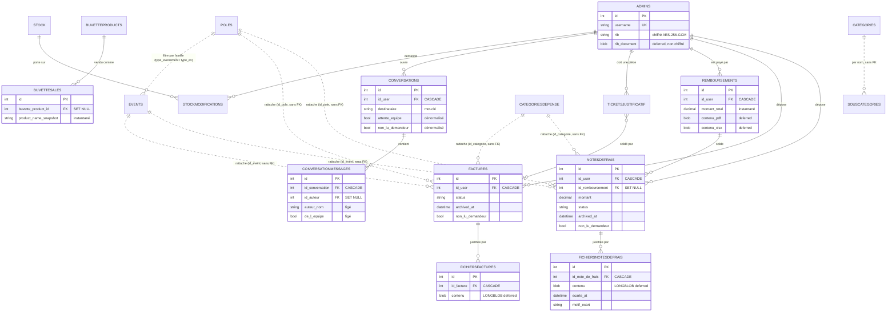

# 02 — Modèle de données

Ce document décrit le schéma MySQL de Kouttâb Stock : les tables, leurs
relations, les colonnes qui portent une décision, la chronologie des migrations,
les énumérations de statuts et les invariants à ne jamais casser.

Sources : `backend/app/db/models.py`, `backend/alembic/versions/*.py`,
`backend/app/core/workflow.py`, `CLAUDE.md` §4.

> **Portée** — uniquement le modèle de données. L'architecture applicative, le
> front, la sécurité, le déploiement et les tests sont documentés ailleurs.

---

## 0. Cadre général

- **Moteur** : MySQL 8.x, InnoDB, charset `utf8mb4` (emojis et accents).
- **Le schéma est partagé avec la version legacy Streamlit.** Dix tables
  préexistent au projet React ; elles ne sont créées par aucune migration
  Alembic mais par `../create_mysql_structure.sql`. Cf. §4.3, anomalie A1.
- **La base est distante** (O2Switch, jointe par tunnel SSH depuis le VPS) :
  chaque requête coûte un aller-retour réseau. C'est la raison de fond derrière
  la plupart des choix de dénormalisation et de `deferred` décrits en §3.
- **23 tables** au total, réparties en dix domaines.
- Les migrations de ce projet **s'écrivent à la main**. `alembic revision
  --autogenerate` voudrait *créer* les dix tables historiques et détruirait la
  production (`2026_07_27_1000-5e4a7b2c8d03_add_auth_security_and_validation_trace.py:7-10`).

---

## 1. Les tables, par domaine

Conventions de lecture : « FK » liste les clés étrangères **déclarées dans le
modèle**, avec leur `ondelete`. Les index listés sont ceux de `__table_args__`
(donc ceux que `create_all` monte en développement) ; les index posés
uniquement par migration sont signalés en §4.3, anomalie A3.

### 1.1 Stock

| Table | Rôle |
|---|---|
| `Stock` | Un article de l'inventaire de l'association. |

`backend/app/db/models.py:33`

- **Colonnes notables** : `nom` (VARCHAR 255, **UNIQUE**), `categorie`,
  `sous_categorie`, `quantite`, `seuil_alerte` (défaut 10), `emoji` (défaut
  📦), `barcode` (VARCHAR 32, **UNIQUE**, indexé — `models.py:47`),
  `alert_sent` (drapeau anti-répétition de l'alerte de seuil).
- **FK** : aucune.
- **Index** : `idx_categorie`, `idx_nom`, plus l'index unique sur `barcode`.
- **Relation** : `Stock.modifications` → `StockModifications`, en
  `cascade="all, delete-orphan"` côté ORM.

| Table | Rôle |
|---|---|
| `StockModifications` | Demande de modification de quantité d'un bénévole, à approuver. |

`backend/app/db/models.py:833`

- **Colonnes notables** : `quantite_actuelle`, `quantite_demandee`,
  `date_demande`, `status`, `date_approbation`, `commentaires`.
- **FK** : `id_user → Admins.id` **CASCADE** ; `id_stock → Stock.id`
  **CASCADE** ; `approuve_par → Admins.id` **SET NULL** (`models.py:843-855`).
  Le contraste est volontaire : la demande n'a pas de sens sans son demandeur
  ni son article, mais elle survit à la suppression du compte qui l'a approuvée.
- **Index** : `idx_sm_user`, `idx_sm_stock`, `idx_sm_status`,
  `idx_sm_date_demande`.

### 1.2 Utilisateurs et sécurité d'accès

| Table | Rôle |
|---|---|
| `Admins` | Un compte utilisateur, tous rôles confondus, et son profil bancaire. |

`backend/app/db/models.py:88`

- **Colonnes notables** : `username` (**UNIQUE**), `password_hash` (bcrypt),
  `role`, `validation_status`, `nom`, `prenom`, `email`, `telephone`,
  **`rib`** (chiffré, cf. §3.1), **`rib_document`** + `rib_document_nom` +
  `rib_document_type` (cf. §3.2).
- **FK** : aucune. C'est la table racine du schéma.
- **Index** : `idx_admins_username`, `idx_admins_email`, `idx_admins_role`.
- **Relations** : `expenses` et `invoices`, toutes deux déclarées avec
  `foreign_keys=` explicite — `Factures` et `NotesDeFrais` portent désormais
  **deux** clés vers `Admins` (le déposant et le valideur), ce qui rendrait la
  jointure ambiguë sans désambiguïsation (`models.py:129-131`).
- **Propriété** `full_name` : `prenom nom`, avec repli sur `username`
  (`models.py:145`).

| Table | Rôle |
|---|---|
| `AdminInvitations` | Jeton d'invitation par courriel, pour créer un compte administrateur. |

`backend/app/db/models.py:151`

- **Colonnes notables** : `email` (**UNIQUE**), `token_hash` (SHA256 — jamais le
  jeton en clair), `expires_at`, `used`, `attempts`.
- **FK** : aucune (l'invité n'a pas encore de compte).
- **Index** : `idx_inv_email`, `idx_inv_token`, `idx_inv_expires_at`.

| Table | Rôle |
|---|---|
| `PasswordResets` | Jeton de réinitialisation de mot de passe d'un compte existant. |

`backend/app/db/models.py:168`

- **Colonnes notables** : `token_hash` (SHA256, même patron que les
  invitations), `expires_at`, `used_at`, `requested_ip` (VARCHAR 45 : longueur
  d'une IPv6).
- **FK** : `id_user → Admins.id` **CASCADE**.
- **Index** : `idx_reset_token`, `idx_reset_user`, `idx_reset_expires`.
- **Pourquoi une table distincte des invitations** : une invitation *crée* un
  compte, une réinitialisation en *modifie* un existant. Les confondre
  reviendrait à laisser un lien d'invitation changer le mot de passe d'un compte
  déjà en place (`models.py:174-177`).
- **Pourquoi `id_user` et non l'adresse** : elle peut changer entre la demande
  et le clic, et le jeton doit rester rattaché au compte, pas à une chaîne
  (`models.py:179-180`).

| Table | Rôle |
|---|---|
| `LoginAttempts` | Compteur d'échecs de connexion et verrouillage, persistés en base. |

`backend/app/db/models.py:201`

- **Colonnes notables** : `username`, `ip_address` (VARCHAR 45), `failed_count`,
  `locked_until`, `last_attempt_at`.
- **FK** : aucune — un échec porte sur un `username` qui peut ne correspondre à
  aucun compte.
- **Contraintes / index** : **UNIQUE (`username`, `ip_address`)**
  (`uq_login_attempt`), `idx_login_attempt_locked_until`.
- **Pourquoi en base** : le verrouillage était un dictionnaire en mémoire du
  process — il disparaissait à chaque redémarrage Passenger, n'était pas partagé
  entre workers, et grossissait sans borne (`models.py:203-208`).
- **Pourquoi la clé (username, ip)** : verrouiller sur le seul `username`
  permettait à un tiers de bloquer n'importe quel compte en cinq requêtes
  (`models.py:209-210`).

| Table | Rôle |
|---|---|
| `RefreshTokens` | Refresh tokens émis, pour permettre rotation et révocation. |

`backend/app/db/models.py:230`

- **Colonnes notables** : `jti_hash` (SHA256 du `jti`, **UNIQUE**),
  `expires_at`, `revoked_at`, `rotated_at`.
- **FK** : `id_user → Admins.id` **CASCADE**.
- **Index** : `idx_refresh_user`, `idx_refresh_expires`.
- **Pourquoi** : sans cette table, `/auth/logout` ne révoquait rien et un
  refresh token volé restait valide sept jours (`models.py:233-234`).
- **`rotated_at`** : renseigné quand le token est consommé par une rotation. Si
  un token déjà tourné est représenté, c'est le signe d'un vol et **toute la
  famille saute** (`models.py:251-252`).

### 1.3 Notes de frais

| Table | Rôle |
|---|---|
| `NotesDeFrais` | Une dépense avancée par un bénévole, à valider puis à rembourser. |

`backend/app/db/models.py:563`

- **Colonnes notables** : `date_depense`, `rattachement` (champ hérité,
  conservé tel quel), `fournisseur`, `nature_charge`, `montant` DECIMAL(10,2),
  `commentaires`, `remboursement_deja_emis` DECIMAL(10,2) (avance déjà perçue,
  à soustraire du total), `remise`, `status`, `commentaires_compta`,
  `date_soumission`.
- **Rattachement comptable** : `id_pole` / `pole`, `id_event` / `evenement`,
  `date_evenement`, `id_categorie` / `categorie` — identifiant **et** libellé en
  double, cf. §3.9.
- **Traçabilité** : `validated_by`, `validated_at`.
- **Suivi du déposant** : `non_lu_demandeur`, cf. §3.6.
- **Archivage** : `archived_at`, `archived_by`, cf. §3.7.
- **FK** : `id_user → Admins.id` **CASCADE** ; `id_remboursement →
  Remboursements.id` **SET NULL** ; `validated_by → Admins.id` **SET NULL** ;
  `archived_by → Admins.id` **SET NULL**.
  `id_pole`, `id_event`, `id_categorie` sont de simples `Integer` **sans
  contrainte FK déclarée** (`models.py:606-613`).
- **Index** : `idx_nf_user`, `idx_nf_status`, `idx_nf_date_depense`,
  `idx_nf_pole`, `idx_nf_event`.
- **`id_remboursement`** : `NULL` tant que la note n'est pas payée. La
  comptabilité rembourse un **bénévole**, pas une note : un virement couvre
  plusieurs dépenses, et ce rattachement permet de retrouver depuis n'importe
  quelle note le versement qui l'a soldée (`models.py:591-595`).

| Table | Rôle |
|---|---|
| `FichiersNotesDeFrais` | Un justificatif joint à une note de frais, contenu compris. |

`backend/app/db/models.py:659`

- **Colonnes notables** : `nom_fichier`, `chemin_fichier`, `taille_fichier`
  (BIGINT), `type_fichier`, **`contenu`** LONGBLOB `deferred` (cf. §3.3),
  `date_upload`, et le trio d'écart `ecarte_at` / `ecarte_par` / `motif_ecart`
  (cf. §3.8).
- **FK** : `id_note_de_frais → NotesDeFrais.id` **CASCADE** ; `ecarte_par →
  Admins.id` **SET NULL**.
- **Index** : `idx_fnf_note`.

### 1.4 Factures

| Table | Rôle |
|---|---|
| `Factures` | Une facture déposée par un bénévole, traitée par la comptabilité. |

`backend/app/db/models.py:710`

- **Colonnes notables** : `commentaire`, `date_depot`, `status`,
  `fournisseur`, `montant` DECIMAL(10,2), `commentaires_compta`,
  `non_lu_demandeur`, `archived_at` / `archived_by`.
- **Rattachement comptable** : `id_pole` / `pole`, `id_event` / `evenement`,
  `date_evenement`, `id_categorie` / `categorie` — cf. §3.9. **Tout est
  nullable** : la table contient des lignes en production, et l'obligation de
  saisie est portée par Pydantic pour les nouveaux dépôts (`models.py:738-739`).
- **Traçabilité** : `validated_by`, `validated_at`. Sans ces deux colonnes, il
  était impossible de savoir quel comptable avait validé quelle facture, ni
  quand (`models.py:753-754`).
- **`commentaires_compta`** : il n'existait pas — une facture refusée arrivait
  sans la moindre explication, et le déposant n'avait aucun moyen de savoir quoi
  corriger. Les notes de frais le portaient depuis toujours
  (`models.py:760-762`).
- **FK** : `id_user → Admins.id` **CASCADE** ; `validated_by → Admins.id`
  **SET NULL** ; `archived_by → Admins.id` **SET NULL**. `id_pole`, `id_event`,
  `id_categorie` sans contrainte FK.
- **Index** : `idx_facture_user`, `idx_facture_status`, `idx_facture_date_depot`,
  `idx_facture_pole`, `idx_facture_event`, `idx_facture_date_evenement`.

| Table | Rôle |
|---|---|
| `FichiersFactures` | Un justificatif joint à une facture, contenu compris. |

`backend/app/db/models.py:792`

- **Colonnes notables** : mêmes que `FichiersNotesDeFrais`, **sans le trio
  d'écart** — l'écart n'existe que pour les notes de frais (migration
  `f2b9d4e7a1c3`).
- **FK** : `id_facture → Factures.id` **CASCADE**.
- **Index** : `idx_ff_facture`.

### 1.5 Remboursements

| Table | Rôle |
|---|---|
| `Remboursements` | Un versement à un bénévole, soldant une ou plusieurs notes de frais. |

`backend/app/db/models.py:492`

- **Colonnes notables** : `date_remboursement`, bloc « Apurement » du modèle
  remis à la comptabilité — `moyen`, `etablissement`, `approuve_par` (listes
  figées côté application dans `core/reimbursement_options.py`, **stockées en
  clair** pour que le justificatif déjà émis reste lisible si ces listes
  évoluent, `models.py:518-520`) —, `montant_total` DECIMAL(10,2) (instantané,
  cf. §3.5), `commentaire`.
- **Documents** : `contenu_pdf` et `contenu_xlsx` LONGBLOB `deferred`
  (cf. §3.4), plus `chemin_pdf` / `chemin_xlsx` conservés comme cache local et
  surtout comme source des pièces jointes de la file d'envoi, qui travaille sur
  des fichiers (`models.py:544-545`).
- **FK** : `id_user → Admins.id` **CASCADE** ; `cree_par → Admins.id`
  **SET NULL**.
- **Index** : `idx_remb_user`, `idx_remb_date`.
- **Relation inverse** : `Reimbursement.expenses` ↔ `Expense.reimbursement`.

### 1.6 Tickets de justificatif

| Table | Rôle |
|---|---|
| `TicketsJustificatif` | Une demande de pièce manquante adressée à un bénévole, avec ses relances. |

`backend/app/db/models.py:426`

- **Colonnes notables** : `libelle` (**le seul champ obligatoire** — ouvrir un
  ticket doit rester possible avec ce qu'on a sous la main, `models.py:435-436`),
  `description`, `montant_attendu`, `date_achat`, `fournisseur`, `statut`,
  `rappels_envoyes`, `dernier_rappel_at`, `closed_at`.
- **FK** : `id_user → Admins.id` **CASCADE** (le bénévole à qui la pièce est
  demandée) ; `cree_par → Admins.id` **SET NULL** ; `closed_by → Admins.id`
  **SET NULL** ; `id_facture → Factures.id` **SET NULL** (la pièce qui solde le
  ticket, rattachée **à la main** par la comptabilité).
- **Index** : `idx_ticket_user`, `idx_ticket_statut`.
- **Pourquoi la clôture est manuelle** : fermer sur le premier dépôt du bénévole
  aurait fermé le ticket à tort dès qu'il dépose une facture sans rapport, et
  les relances se seraient tues alors que la pièce attendue manquait toujours
  (`models.py:438-440`).
- **La clôture supprime la ligne** (`crud/ticket.close_ticket`). Seule table du
  modèle dans ce cas : partout ailleurs on archive. Un ticket est une relance,
  pas une pièce comptable — la facture reçue, lui, ne documente plus rien.
  `statut`, `closed_at` et `closed_by` sont renseignés puis l'objet est
  supprimé : ils ne servent plus qu'à la réponse HTTP et au journal. Une
  fermeture par erreur se rattrape en rouvrant une demande.

### 1.7 Conversations

| Table | Rôle |
|---|---|
| `Conversations` | Un fil de discussion entre un bénévole et l'équipe (comptabilité ou administration). |

`backend/app/db/models.py:957`

- **Colonnes notables** : `destinataire` (**mot-clé**, jamais une adresse : le
  serveur seul sait à qui il correspond, `models.py:993`), `sujet` (VARCHAR
  150), `statut`, `attente_equipe` et `non_lu_demandeur` (dénormalisés, cf.
  §3.6), `closed_at`.
- **FK** : `id_user → Admins.id` **CASCADE** (l'auteur, **jamais saisi** :
  repris du compte connecté, `models.py:989`) ; `closed_by → Admins.id`
  **SET NULL**.
- **Index** : `idx_conv_user`, `idx_conv_statut`, `idx_conv_destinataire`.
- **Relation** : `messages`, `cascade="all, delete-orphan"`, ordonnée par
  `ConversationMessage.id`.

| Table | Rôle |
|---|---|
| `ConversationMessages` | Un message dans un fil. |

`backend/app/db/models.py:1021`

- **Colonnes notables** : `auteur_nom` (VARCHAR 150) et `de_l_equipe`, **figés à
  l'écriture** (cf. §3.6bis), `corps` TEXT.
- **FK** : `id_conversation → Conversations.id` **CASCADE** ; `id_auteur →
  Admins.id` **SET NULL**.
- **Index** : `idx_convmsg_conversation`.

### 1.8 Buvette

| Table | Rôle |
|---|---|
| `BuvetteProducts` | Un produit de la buvette, synchronisé depuis la boutique HelloAsso ou saisi à la main. |

`backend/app/db/models.py:867`

- **Colonnes notables** : `helloasso_tier_id` (**UNIQUE**, indexé — clé de
  rapprochement avec HelloAsso), `name`, `description`, `price_cents`,
  `quantity` (le stock local est la source de vérité, la synchronisation n'y
  touche jamais), `seuil_alerte` (défaut 5), `emoji` (défaut 🥤), `image_url`,
  `barcode` (**UNIQUE**, indexé), `is_active`, `alert_sent`, `last_synced_at`.
- **FK** : aucune.
- **Index** : `idx_buvette_prod_tier`, `idx_buvette_prod_active`.
- **Propriété** `low_stock` : `quantity < seuil_alerte` (`models.py:906`).

| Table | Rôle |
|---|---|
| `BuvetteSales` | Journal idempotent des ventes reçues par webhook HelloAsso. |

`backend/app/db/models.py:911`

- **Colonnes notables** : `helloasso_order_id`, `helloasso_payment_id`,
  `helloasso_item_id`, `product_name_snapshot` (**instantané**, VARCHAR 255,
  NOT NULL), `quantity_sold`, `amount_cents`, identité client
  (`customer_first_name`, `customer_last_name`, `customer_email`), `raw_event`
  (JSON brut en TEXT), `sold_at`, `processed_at`.
- **FK** : `buvette_product_id → BuvetteProducts.id` **SET NULL** — une vente
  reste une trace comptable même si le produit est supprimé du catalogue.
- **Contraintes / index** : **UNIQUE (`helloasso_payment_id`,
  `helloasso_item_id`)** (`uq_sale_payment_item`) — c'est **l'idempotence
  garantie par la base** : HelloAsso peut rejouer un appel, un même item ne peut
  pas décrémenter le stock deux fois. Plus `idx_buvette_sale_order`,
  `_payment`, `_item`, `_product`, `_processed`.

### 1.9 Référentiels comptables

| Table | Rôle |
|---|---|
| `Poles` | Pôle de rattachement d'une dépense (référentiel administrable). |

`backend/app/db/models.py:260`

- **Colonnes notables** : `nom` (VARCHAR 120, **UNIQUE**), `is_default`,
  `is_active`, `ordre`, `requiert_evenement`, `type_evenement`.
- **FK** : aucune.
- **Index** : `idx_pole_nom`, `idx_pole_active`.
- **Pourquoi une table et non une énumération** : le client a annoncé que la
  liste évoluerait (`models.py:262-264`).
- **`is_active` plutôt qu'une suppression** : une facture de 2026 doit garder un
  pôle lisible même si celui-ci n'est plus proposé en 2027 (`models.py:276-277`).
- **`requiert_evenement`** : le pôle déclare lui-même s'il exige **en plus** de
  la catégorie un événement et sa date. Une dépense du local (courses, goûter,
  matériel) n'a pas d'événement, et l'exiger obligeait à en inventer un pour
  satisfaire le formulaire. Le drapeau vit sur le pôle plutôt que dans le code :
  un pôle créé demain déclare son attente **sans redéploiement**
  (`models.py:280-286`). La catégorie, elle, ne dépend d'aucun drapeau — elle
  est demandée partout depuis `b4d8f6c3e0a5`.
- **`type_evenement`** : famille (« T », « G », « J ») des événements proposés
  sous ce pôle. `NULL` = aucun filtre (`models.py:290-294`).

| Table | Rôle |
|---|---|
| `CategoriesDepense` | Nature d'une dépense — ce qui a été acheté — demandée sous **tous** les pôles (référentiel administrable). |

`backend/app/db/models.py:302`

- **Colonnes notables** : `nom` (VARCHAR 120, **UNIQUE**), `is_default`,
  `is_active`, `ordre`.
- **FK** : aucune.
- **Index** : `idx_catdep_nom`, `idx_catdep_active`.
- **Rôle exact** : ce que l'événement est au pôle événementiel, la catégorie
  l'est aux autres — la deuxième composante du nom du justificatif envoyé au
  comptable. « Local_Courses_2026-08-12.pdf » s'impute sans avoir à ouvrir le
  PDF (`models.py:304-308`).
- Même désactivation-plutôt-que-suppression que pour les pôles, même raison :
  une note de 2026 doit rester lisible si la catégorie disparaît en 2027
  (`models.py:323-324`).

| Table | Rôle |
|---|---|
| `Events` | Événement, synchronisé depuis HelloAsso ou saisi manuellement. |

`backend/app/db/models.py:333`

- **Colonnes notables** : `helloasso_form_slug`, `helloasso_form_type`, `nom`,
  `date_evenement`, `date_fin`, `url`, `helloasso_state`, `source`
  (`helloasso` | `manuel` — la synchronisation ne touche jamais au manuel),
  `type_ev`, `is_active`, `last_synced_at`.
- **FK** : aucune.
- **Contraintes / index** : **UNIQUE (`helloasso_form_type`,
  `helloasso_form_slug`)** (`uq_event_helloasso`) — HelloAsso ne garantit
  l'unicité d'un slug que **par type de formulaire**, un `Shop/gala` et un
  `Event/gala` peuvent coexister. Les événements saisis à la main ont un slug
  `NULL`, et MySQL autorise les NULL multiples dans un index unique, ce qui
  permet d'en créer autant que nécessaire sans contorsion (`models.py:335-340`).
  Plus `idx_event_nom`, `idx_event_date`, `idx_event_active`.
- **`type_ev`** : renseigné **à la main** — HelloAsso ne connaît pas cette
  classification, et la synchronisation n'y touche donc jamais. Un événement non
  classé (`NULL`) reste proposé sous **tous** les pôles EV, sans quoi la
  première synchronisation viderait les listes, chaque événement importé
  arrivant sans famille (`models.py:365-370`).

### 1.10 Référentiels de stock

| Table | Rôle |
|---|---|
| `Categories` | Référentiel des catégories d'articles. |

`backend/app/db/models.py:61` — `nom` (**UNIQUE**), `is_default`,
`created_at`. Index `idx_cat_nom`. Aucune FK.

| Table | Rôle |
|---|---|
| `SousCategories` | Hiérarchie catégorie → sous-catégorie. |

`backend/app/db/models.py:71` — `nom_categorie`, `nom_sous_categorie`.
**UNIQUE (`nom_categorie`, `nom_sous_categorie`)** (`unique_category_sub`),
index `idx_subcat_categorie` et `idx_subcat_sous_categorie`. Le lien vers
`Categories` est **logique**, par le nom : aucune FK déclarée.

### 1.11 File d'envoi

| Table | Rôle |
|---|---|
| `OutboundEmails` | File d'attente persistante des envois (comptabilité, déposant, relances). |

`backend/app/db/models.py:380`

- **Colonnes notables** : `kind`, `entity_type` + `entity_id` (référence
  polymorphe, sans FK), `recipients` (JSON en TEXT), `subject`, `body`,
  `attachments` (JSON en TEXT), `status`, `attempts`, `max_attempts` (défaut 5),
  `last_error`, `locked_at`, `next_retry_at`, `sent_at`, `triggered_by`.
- **FK** : aucune — `triggered_by` et `entity_id` sont de simples entiers.
- **Index** : `idx_outmail_status`, `idx_outmail_entity` (`entity_type`,
  `entity_id`), `idx_outmail_retry` (`status`, `next_retry_at`) — ce dernier
  sert exactement la requête du cron.
- **Motif « transactional outbox »** : l'intention d'envoyer est écrite en base
  **dans la même transaction que la pièce**. Elle survit donc à un crash, à un
  redémarrage Passenger ou à une coupure SMTP — là où un `BackgroundTask` dont
  l'exception est avalée ne laisse aucune trace (`models.py:383-387`).
- **`status='sending'` + `locked_at` forment un verrou** : deux exécutions du
  cron peuvent se chevaucher, et un même justificatif envoyé deux fois au
  comptable est une vraie nuisance (`models.py:388-390`).

---

## 2. Schéma des relations

Les liens en trait plein sont des clés étrangères réelles ; les liens en
pointillés sont des rattachements **logiques**, sans contrainte en base (cf. §1.3
et §1.10). Les tables de sécurité d'accès et la file d'envoi sont laissées de
côté pour la lisibilité : les premières pendent toutes de `Admins`, la seconde
n'a aucune clé étrangère.



---

## 3. Les colonnes qui portent une décision

Ces colonnes ne sont pas de simples champs : chacune est une décision prise
contre un problème constaté, et documentée à l'endroit qui compte — la
définition de la colonne.

### 3.1 `Admins.rib` — chiffré au repos, au niveau de la colonne

`backend/app/db/models.py:105-108`, type dans `backend/app/db/types.py:23`.

```python
rib: Mapped[str | None] = mapped_column(ChampChiffre(255), nullable=True)
```

- **La décision** : `rib` est chiffré en **AES-256-GCM** par un
  `TypeDecorator` maison, `ChampChiffre`, et non par le CRUD.
- **Pourquoi chiffrer** : c'est le champ le plus sensible de la base, et *les
  permissions applicatives ne protègent rien de ce qui contourne l'application*
  — export, sauvegarde, accès MySQL direct (`models.py:105-107`).
- **Pourquoi au niveau de la colonne et non du CRUD** : tout ce qui lit ou écrit
  `Admin.rib` traverse le chiffrement, **y compris le code écrit plus tard qui
  ignorerait tout du sujet**. « Un chiffrement qu'on peut oublier d'appeler finit
  toujours par être oublié quelque part » (`types.py:3-6`).
- **Le stockage ne bouge pas** : `VARCHAR(255)`. Le schéma MySQL est partagé avec
  la version legacy et ne doit pas changer ; une valeur chiffrée y tient, la
  validation Pydantic bornant la saisie en amont (`types.py:26-28`).
- **Tolérance en lecture** : une valeur illisible ne fait pas tomber la requête —
  la note de frais s'affiche sans le RIB et l'incident est journalisé. Le
  contraire rendrait la page inaccessible pour un seul compte abîmé, alors que la
  comptabilité a besoin des autres (`types.py:41-54`).
- **Compatibilité** : les valeurs en clair héritées restent lisibles (absence du
  préfixe `gcm1:`), ce qui rend le déploiement sans coupure.
- **La clé** vit dans `RIB_ENCRYPTION_KEY` ; **la perdre rend les RIB
  définitivement illisibles**.

### 3.2 `Admins.rib_document` — en base, `deferred`, **non chiffré**

`backend/app/db/models.py:109-123`.

- **Ce que c'est** : le relevé d'identité bancaire déposé par le bénévole — le
  document de sa banque, que la comptabilité télécharge au moment de payer.
  L'IBAN saisi sert au virement, **ce document sert de preuve**
  (`models.py:109-111`).
- **En base**, comme les justificatifs, et **`deferred` pour la même raison** :
  lister les utilisateurs ne doit pas rapatrier les pièces de chacun
  (`models.py:113-114`).
- **L'asymétrie avec `rib`, et pourquoi** : le contenu **n'est pas chiffré**,
  pour deux raisons données à la colonne (`models.py:116-118`) :
  1. **un BLOB traverserait mal `ChampChiffre`**, conçu pour du texte ;
  2. **la protection utile ici est le contrôle d'accès** — propriétaire, Compta,
     Super Admin.
- **Corollaire** (`CLAUDE.md` §14) : ce document est en base et **sans copie
  disque**, contrairement aux justificatifs — rien ne l'envoie par courriel, donc
  rien n'a besoin d'un chemin, et une copie de plus d'une donnée bancaire serait
  une surface de fuite de plus. `files.lire_en_memoire` valide sans écrire.

### 3.3 `FichiersNotesDeFrais.contenu` / `FichiersFactures.contenu` — LONGBLOB `deferred`

`backend/app/db/models.py:671-691` et `804-824`, migration `f6b3d1e8a295`.

- **Le problème** : les fichiers vivaient **uniquement** sur le disque du VPS,
  hors de toute sauvegarde. La table ne gardait qu'un chemin, et perdre la
  machine revenait à perdre des pièces comptables que l'association est tenue de
  conserver plusieurs années.
- **Le raisonnement chiffré qui a tranché** — c'est une décision *prise sur
  mesure*, pas un principe : **11 Mo pour l'ensemble des justificatifs, le plus
  gros fichier à 4,5 Mo**. À cette échelle, la base — déjà sauvegardée par
  O2Switch — est le bon endroit, et **supprime le problème au lieu d'ajouter un
  mécanisme de sauvegarde de plus**. « Il en irait autrement avec plusieurs
  gigaoctets » ; la décision serait à revoir au-delà de quelques centaines de
  mégaoctets.
- **`deferred=True` est INDISPENSABLE** : sans lui, lister les notes de frais
  chargerait tous les octets de tous les justificatifs en mémoire, **depuis une
  base distante**. Le contenu n'est lu qu'à l'accès explicite.
- **`chemin_fichier` est conservé** : il reste renseigné, sert de repli pour les
  pièces antérieures à la migration, et documente d'où vient le fichier. Ce qui
  exige un chemin (conversion PDF, pièces jointes) passe par
  `files.materialiser`, qui réécrit le fichier depuis la base au besoin.
- **Garde-fou dans la migration** : elle vérifie `@@max_allowed_packet`
  **avant** d'écrire quoi que ce soit, avec une marge de 2 Mo. Une migration qui
  s'arrêterait au milieu laisserait la moitié des pièces en base et l'autre sur
  le disque, « sans que rien ne dise laquelle est laquelle ».

### 3.4 `Remboursements.contenu_pdf` / `contenu_xlsx` — la dernière famille passée en base

`backend/app/db/models.py:528-547`, migration `d0f7b2c5e8a9`.

- **La décision** : les deux documents produits au moment du remboursement (PDF
  et tableur) sont stockés en base, en LONGBLOB `deferred`.
- **Pourquoi** : mêmes raisons que les justificatifs — *la base est sauvegardée
  par l'hébergeur, le volume Docker ne l'est pas*. Ils étaient **la dernière
  famille de documents restée sur le seul disque** : un `docker compose down -v`,
  un changement de VPS ou un `volume prune` laissait des **remboursements
  enregistrés sans leur preuve**, alors que ce document porte le montant versé,
  le moyen et l'approbation.
- **`deferred`** : lister les remboursements ne doit pas rapatrier les documents
  de tout le monde depuis une base distante.
- **Les chemins restent** : cache local, et surtout source des pièces jointes de
  la file d'envoi, qui travaille sur des fichiers. Le disque n'est plus qu'un
  cache.

### 3.5 `Remboursements.montant_total` — un instantané

`backend/app/db/models.py:500-503` et `525`.

- **La décision** : le montant versé est **stocké**, jamais recalculé depuis les
  notes rattachées.
- **Pourquoi** : il fige ce qui a réellement été viré. Recalculer ce total à
  partir des notes ferait **bouger un chiffre déjà justifié** le jour où l'une
  d'elles serait corrigée — et le document, lui, est déjà parti.
- **Même famille** que `Invoice.pole` et `BuvetteSale.product_name_snapshot` :
  le modèle assume une classe d'« instantanés », cf. §3.9.

### 3.6 `Conversations.attente_equipe` / `non_lu_demandeur`, et `Expense`/`Invoice.non_lu_demandeur` — dénormalisés

`backend/app/db/models.py:967-971`, `998-1001`, `623-627`, `765-767` ;
migration `e1a8c3d6f0b2`.

- **La décision** : ces drapeaux sont portés par la ligne elle-même, **et non
  déduits du dernier message** ni de l'historique des décisions.
- **Pourquoi** : ce sont *exactement* les deux questions que posent les pastilles
  **à chaque chargement de page**, et les recalculer imposerait une sous-requête
  sur les messages à chaque fois, **vers une base distante**.
- **Cycle de vie** : `non_lu_demandeur` est allumé par **toute décision de la
  comptabilité — statut ou commentaire** —, et éteint quand le déposant **ouvre
  sa liste** (`crud.*.marquer_lues`, appelé par l'endpoint qui sert un écran,
  jamais par la lecture elle-même).
- **Ce que ça corrigeait** : le commentaire n'allumait rien. Il fallait ouvrir
  « Mes demandes » et repérer soi-même l'encart — or c'est souvent lui qui porte
  la demande de correction. Le seul canal était un courriel best-effort, qui
  n'arrivait pas quand `EMAIL_ENABLED` était tombé.

### 3.6bis `ConversationMessages.auteur_nom` / `de_l_equipe` — figés à l'écriture

`backend/app/db/models.py:1022-1027`, `1040-1041`.

- **La décision** : le nom de l'auteur et son appartenance à l'équipe sont
  **copiés dans le message au moment de l'écrire**, plutôt que lus par jointure
  sur `Admins` à l'affichage.
- **Pourquoi, deux raisons distinctes** :
  1. **un compte supprimé laisserait sinon des messages anonymes** (`id_auteur`
     est en `SET NULL`) ;
  2. **un bénévole promu comptable ferait rétroactivement passer ses anciennes
     questions pour des réponses de l'équipe** — le fil se relirait à l'envers.

### 3.7 `archived_at` / `archived_by` sur `NotesDeFrais` et `Factures`

`backend/app/db/models.py:629-639` et `769-776` ; migrations `b8d5f3a0c4e7`
(notes) puis `a3c7e5b2f9d4` (factures).

- **La décision** : la pièce **sort des listes courantes sans quitter la base**,
  et l'opération se défait.
- **Pourquoi, côté notes de frais** : la suppression **effaçait** la ligne et les
  justificatifs avec elle. « Une pièce comptable que l'association doit conserver
  plusieurs années disparaissait sur un clic, **sans trace de son existence** ».
  Archiver range sans détruire, et se défait.
- **Pourquoi, côté factures** : même raisonnement, appliqué là où il manquait —
  le `DELETE` d'origine détruisait la facture, ses fichiers et leur contenu en
  base, sur **n'importe quel** statut, y compris « Validée », c'est-à-dire déjà
  comptabilisée.
- **`archived_by`** en `SET NULL` : savoir *qui* a rangé, sans que la suppression
  de ce compte ne fasse disparaître l'archive.

### 3.8 `ecarte_at` / `ecarte_par` / `motif_ecart` sur `FichiersNotesDeFrais`

`backend/app/db/models.py:694-702`, migration `f2b9d4e7a1c3`.

- **La décision** : une pièce illisible ou mal rattachée **sort du dossier sans
  quitter la base**, et se rétablit.
- **Pourquoi** : elle ne pouvait ni être retirée ni remplacée — `attach_file`
  n'était appelé qu'à la création, et l'écran conseillait même de « supprimer
  cette note et la recréer ».
- **Effet** : la pièce sort aussi **du circuit comptable** —
  `services/compta_dispatch.py:178` ne joint que les fichiers dont `ecarte_at`
  est `NULL`.
- **`motif_ecart` est obligatoire** : « le motif accompagne le geste : sans lui,
  le déposant ne sait pas ce qu'on lui reproche, et **redépose la même chose** ».
  Il lui est montré.
- Écarter et **ajouter** vont ensemble : livrer le premier sans le second aurait
  fait de cet écran un piège, la note se retrouvant sans justificatif et sans
  recours.

### 3.9 `Invoice.pole` / `evenement` en double avec leur identifiant

`backend/app/db/models.py:729-749` (et les colonnes jumelles sur `NotesDeFrais`,
`models.py:600-613`).

- **La décision** : chaque rattachement existe **en double** — l'identifiant
  (`id_pole`, `id_event`, `id_categorie`) pour filtrer et agréger, le libellé en
  clair (`pole`, `evenement`, `categorie`) **comme instantané**.
- **Pourquoi** : le nom du PDF envoyé au comptable est **figé au dépôt**.
  Renommer un pôle six mois plus tard **ne doit pas désaligner les fichiers déjà
  dans sa boîte mail**. Même raisonnement que
  `BuvetteSale.product_name_snapshot` et que `Remboursements.montant_total`.
- **Deuxième rôle du champ texte** : il porte le cas « **saisie libre** », quand
  l'événement n'existe pas côté HelloAsso (facture d'électricité, achat
  courant) — `id_event` vaut alors `NULL`.
- **Pourquoi tout est nullable** : la table contient des lignes en production, et
  l'obligation de saisie est portée par **Pydantic** pour les nouveaux dépôts,
  pas par le schéma.
- **Les mêmes champs sur `NotesDeFrais`** : pour que le comptable reçoive les
  tickets de caisse et les factures **sous une nomenclature identique**.
  `rattachement` est conservé tel quel — il précède ces champs et reste
  renseigné sur les notes existantes.

---

## 4. Chronologie des migrations

### 4.1 La chaîne

Racine `7a1b3c5d9e01` (`down_revision = None`) → tête `a3c7e5b2f9d4`.
**Chaîne strictement linéaire** : une seule racine, une seule tête, aucun
branchement, aucun `depends_on`, aucun chaînon manquant. L'ordre des
`down_revision` coïncide avec l'ordre chronologique des noms de fichiers.

### 4.2 Le tableau

| # | Révision | Fichier | Ce qu'elle fait | Pourquoi |
|---|---|---|---|---|
| 1 | `7a1b3c5d9e01` | `2026_05_03_1200-…_add_buvette_tables.py` | Crée `BuvetteProducts` et `BuvetteSales`, avec l'unicité `(helloasso_payment_id, helloasso_item_id)`. | Amorce le module buvette. L'unicité est le socle de l'idempotence du webhook : HelloAsso peut rejouer un appel, un item ne doit pas décrémenter deux fois. |
| 2 | `3c9d1e2f4a02` | `2026_05_04_0900-…_add_barcode_columns.py` | Ajoute `barcode` (VARCHAR 32, index unique) sur `Stock` et `BuvetteProducts`. | Permettre la saisie au scanner sur les deux inventaires. |
| 3 | `5e4a7b2c8d03` | `2026_07_27_1000-…_add_auth_security_and_validation_trace.py` | Crée `LoginAttempts` et `RefreshTokens` ; ajoute `validated_by` / `validated_at` sur `Factures` **et** `NotesDeFrais`. | Le verrouillage vivait en mémoire du process (perdu au redémarrage, non partagé entre workers) ; `/auth/logout` ne pouvait rien révoquer ; et rien ne disait quel comptable avait validé quoi, ni quand. Porte l'avertissement : **ne jamais régénérer par autogenerate**. |
| 4 | `6f5b8c3d9e04` | `2026_07_27_1100-…_add_billing_module.py` | Crée `Poles`, `Events`, `OutboundEmails` ; ajoute le rattachement comptable (`id_pole`, `pole`, `id_event`, `evenement`, `date_evenement`) sur `Factures` **et** `NotesDeFrais`, plus `fournisseur` et `montant` sur `Factures`. | Ouvre le circuit comptable : nomenclature des pièces et file d'envoi persistante. Même avertissement autogenerate. |
| 5 | `8a6c9d4e0f05` | `2026_08_11_1900-…_rename_remb_emis_to_amount.py` | Remplace `NotesDeFrais.remb_emis` (booléen legacy) par `remboursement_deja_emis` DECIMAL(10,2). | L'UI acceptait un **montant** d'avance reçue face à un booléen hérité `NOT NULL` sans défaut applicatif : **toute création de note échouait**. La conversion est volontairement conservatrice — un booléen ne dit pas *combien*, donc `1` devient `0` et non un montant inventé. |
| 6 | `9b7d0e5f1a06` | `2026_08_12_0100-…_add_password_resets.py` | Crée `PasswordResets`. | Un oubli de mot de passe imposait une intervention manuelle en base — c'est ce qui est arrivé au **compte Super Admin de production le 2026-08-11**. |
| 7 | `a1c8e6f2b307` | `2026_08_12_1200-…_chiffrer_les_rib_existants.py` | **Migration de données, sans DDL** : chiffre les `Admins.rib` encore en clair. | Le schéma ne bouge pas (`VARCHAR(255)` accueille la valeur chiffrée), seul le contenu change. Ici plutôt que dans un script manuel parce que le déploiement exécute déjà `alembic upgrade head`. **Et il faut la faire en bloc** : réécrire un profil ne convertit pas un RIB inchangé (l'ORM n'émet aucun UPDATE), donc sans elle le RIB de tous ceux qui n'y retouchent jamais resterait en clair indéfiniment. Sans `RIB_ENCRYPTION_KEY`, elle **s'arrête sans rien convertir** plutôt que de laisser la base à moitié chiffrée. Le `downgrade` exige la clé lui aussi. |
| 8 | `b2d9f7a3c418` | `2026_08_12_1400-…_categories_de_depense.py` | Ajoute `Poles.requiert_evenement` (avec bascule à 1 sur `nom LIKE '%nementiel%'`), crée `CategoriesDepense` (5 catégories par défaut), ajoute `id_categorie` / `categorie` sur `NotesDeFrais` et `Factures`. | Tout dépôt exigeait un événement : une dépense du local n'en a aucun, il fallait **en inventer un**, et le comptable recevait des pièces rattachées à des événements fictifs. **Entièrement additif** — les lignes existantes restent valides, leurs colonnes de catégorie simplement nulles. Le `LIKE` plutôt que l'égalité couvre les renommages du pôle, accents compris. |
| 9 | `c3e0a8b4d529` | `2026_08_12_1600-…_poles_ev_par_famille.py` | Ajoute `Poles.type_evenement` et `Events.type_ev` ; aligne le référentiel arrêté par le client (EV(T), EV(G), EV(J), Frais généraux, Institut, Halaqa, Séjour annuel), renomme « Pôle institut » → « Institut », **désactive** « Pôle événementiel » et « Local ». | Le client a arrêté la liste. Renommage **avant** insertion, sinon « Institut » serait créé en double. Désactivation et non suppression : des pièces les référencent. Le `downgrade` ne supprime un pôle **que s'il n'est référencé par aucune facture**. |
| 10 | `d4f1b9c5e63a` | `2026_08_12_1800-…_remboursements_groupes.py` | Crée `Remboursements` ; ajoute `NotesDeFrais.id_remboursement` (+ index + FK). | La comptabilité ne rembourse pas note par note : elle vire un montant à un bénévole. **Entièrement additif** — les notes déjà remboursées restent valides avec `id_remboursement` à `NULL`, elles l'ont été avant que le suivi n'existe. |
| 11 | `e5a2c0d7f184` | `2026_08_12_2000-…_tickets_justificatif.py` | Crée `TicketsJustificatif`. | La comptabilité relançait de mémoire, par messages privés, sans trace : impossible de savoir qui avait déjà été relancé, ni combien de pièces manquaient à la clôture. Table additive. |
| 12 | `f6b3d1e8a295` | `2026_08_12_2200-…_justificatifs_en_base.py` | Ajoute `contenu` (LONGBLOB) sur `FichiersNotesDeFrais` et `FichiersFactures`, **et y charge les fichiers du disque**. | Les fichiers ne vivaient que dans un volume Docker, hors sauvegarde. Décision **chiffrée** : 11 Mo au total, 4,5 Mo pour le plus gros. Contrôle de `@@max_allowed_packet` **avant** toute écriture (marge 2 Mo) ; un fichier absent du disque n'interrompt pas la migration, la ligne reste avec `contenu` à NULL — exactement son état antérieur. |
| 13 | `a7c4e2f9b3d6` | `2026_08_13_1000-…_rib_en_document.py` | Ajoute `rib_document` (LONGBLOB), `rib_document_nom`, `rib_document_type` sur `Admins`. | L'IBAN tapé sert au virement, le document de la banque sert de **preuve** — la comptabilité le réclamait par messages privés faute de pouvoir le récupérer dans l'application. En base pour la même raison que `f6b3d1e8a295`. Non chiffré : `ChampChiffre` travaille sur du texte, et la protection utile sur un document est le contrôle d'accès. |
| 14 | `b8d5f3a0c4e7` | `2026_08_13_1400-…_archiver_les_notes.py` | Ajoute `archived_at` / `archived_by` (+ index, + FK SET NULL) sur `NotesDeFrais`. | `DELETE /expenses/{id}` effaçait la ligne **et** les justificatifs du disque. Deux colonnes suffisent : la note sort des listes, reste en base avec ses pièces, et se restaure. |
| 15 | `c9e6a4b1d5f8` | `2026_08_13_1800-…_conversations.py` | Crée `Conversations` et `ConversationMessages`. | Le formulaire de contact envoyait un courriel et n'en gardait rien : la réponse partait de la boîte du comptable, hors de l'application. Personne ne pouvait dire quelles questions restaient sans réponse. Le courriel subsiste, mais il **prévient seulement**. |
| 16 | `d0f7b2c5e8a9` | `2026_08_13_2200-…_justificatifs_remboursement_en_base.py` | Ajoute `contenu_pdf` / `contenu_xlsx` (LONGBLOB) sur `Remboursements` et y charge les fichiers existants. | **Dernière** famille de documents restée sur le seul disque. Un `down -v`, un changement de VPS ou un `volume prune` laissait des remboursements enregistrés **sans leur preuve** — alors que ce document porte le montant versé, le moyen et l'approbation. |
| 17 | `e1a8c3d6f0b2` | `2026_08_13_2300-…_suivi_non_lu.py` | Ajoute `non_lu_demandeur` (+ index) sur `NotesDeFrais` et `Factures` ; ajoute `Factures.commentaires_compta`. | Un commentaire de la comptabilité n'allumait rien : il fallait ouvrir « Mes demandes » et repérer soi-même l'encart, le seul canal étant un courriel best-effort. Et un **refus de facture arrivait sans motif**, la colonne n'existant nulle part. Dénormalisé pour éviter une sous-requête vers une base distante à chaque chargement. |
| 18 | `f2b9d4e7a1c3` | `2026_08_14_0900-…_ecarter_un_justificatif.py` | Ajoute `ecarte_at` / `ecarte_par` / `motif_ecart` (+ index, + FK SET NULL) sur `FichiersNotesDeFrais`. | Une pièce illisible ou mal rattachée ne pouvait ni être retirée ni remplacée ; l'écran conseillait de « supprimer cette note et la recréer ». Écarter plutôt qu'effacer, comme pour les notes : la pièce sort du dossier, reste en base, se restaure. Le motif accompagne le geste. |
| 19 | `a3c7e5b2f9d4` | `2026_08_14_1100-…_archiver_les_factures.py` | Ajoute `archived_at` / `archived_by` (+ index, + FK SET NULL) sur `Factures`. | Même raisonnement que `b8d5f3a0c4e7`, appliqué là où il manquait : `DELETE /invoices/{id}` supprimait la ligne, ses fichiers et leur contenu en base — sur **n'importe quelle** facture, y compris validée, donc déjà comptabilisée. |
| 20 | `b4d8f6c3e0a5` | `2026_08_14_1600-…_pole_esp_vt_et_natures_de_depense.py` | Insère le pôle `ESP-VT` et quatre natures de dépense (mobilier et petit équipement, fournitures administratives, entretien, réceptions) ; fait passer `Autre` à `ordre = 99`. **Tête actuelle.** | La catégorie était **refusée** sous un pôle événementiel : l'événement dit à quelle occasion la dépense a eu lieu, pas ce qui a été acheté, et le comptable n'avait la nature de la dépense que sur la moitié des pièces. Entièrement additif — `id_categorie` reste nullable, et les pièces événementielles déposées avant ce jour n'en auront jamais : la leur inventer rétroactivement inscrirait dans la comptabilité une information que personne n'a saisie. Insertions en `WHERE NOT EXISTS`, le `ensure_default_*` du démarrage ayant pu prendre les devants. |

### 4.3 Vérification de la chaîne et anomalies

**La chaîne elle-même est saine** : linéaire, sans branche, sans doublon de
révision, sans chaînon orphelin. Trois observations méritent néanmoins d'être
signalées.

**A1 — La racine ne crée pas les tables historiques.** `7a1b3c5d9e01` a
`down_revision = None` mais ne crée que les deux tables de la buvette. Les dix
tables héritées du legacy (`Stock`, `Categories`, `SousCategories`, `Admins`,
`AdminInvitations`, `NotesDeFrais`, `FichiersNotesDeFrais`, `Factures`,
`FichiersFactures`, `StockModifications`) **ne sont créées par aucune
migration** — leur référence est `../create_mysql_structure.sql`.
Conséquence : `alembic upgrade head` sur une base vide échoue dès la révision 2
(`add_column` sur `Stock`). C'est assumé et documenté par ailleurs (`CLAUDE.md`
§10.5 : après création initiale du schéma, faire `alembic stamp head`), mais
c'est la première chose à savoir avant de monter un environnement neuf. C'est
aussi la raison de l'avertissement répété : un `--autogenerate` voudrait
**créer** ces dix tables et détruirait la production.

**A2 — Développement et production ne montent pas le schéma de la même façon.**
Les tests et le développement passent par `create_all` sur les modèles ; la
production passe par Alembic. Deux constantes doivent donc rester alignées à la
main, et les migrations le disent explicitement :
`crud/pole.DEFAULT_POLES` ↔ `POLES` de `c3e0a8b4d529`, et
`crud/expense_category.DEFAULT_CATEGORIES` ↔ `CATEGORIES` de `b2d9f7a3c418`.

**A3 — Des index existent en production mais pas dans les modèles.** Ces index
sont créés par migration sans figurer dans le `__table_args__` correspondant, si
bien qu'un schéma monté par `create_all` ne les a pas :

| Index | Créé par | Absent de |
|---|---|---|
| `idx_nf_remboursement` | `d4f1b9c5e63a` | `Expense.__table_args__` (`models.py:565`) |
| `idx_nf_archived` | `b8d5f3a0c4e7` | idem |
| `idx_notesdefrais_non_lu` | `e1a8c3d6f0b2` | idem |
| `idx_fact_archived` | `a3c7e5b2f9d4` | `Invoice.__table_args__` (`models.py:712`) |
| `idx_factures_non_lu` | `e1a8c3d6f0b2` | idem |
| `idx_fnf_ecarte` | `f2b9d4e7a1c3` | `ExpenseFile.__table_args__` (`models.py:661`) |

Sans conséquence fonctionnelle (les tests ne mesurent pas les plans d'exécution),
mais la divergence est réelle et vaut d'être connue avant d'analyser une lenteur
en développement.

**A4 — `models.__all__` est incomplet.** `models.py:1050-1065` n'exporte que 14
modèles sur 23 : `Pole`, `ExpenseCategory`, `Event`, `OutboundEmail`,
`JustificatifTicket`, `Reimbursement`, `PasswordReset`, `LoginAttempt` et
`RefreshToken` manquent. Sans effet tant que les imports sont nominatifs, mais
un `from app.db.models import *` donnerait une vue tronquée du schéma.

---

## 5. Énumérations de statuts et transitions

Les statuts sont des **chaînes**, pas des `ENUM` MySQL — le schéma est partagé
avec la version legacy. Le contrôle est applicatif, dans
`backend/app/core/workflow.py`.

### 5.1 Les énumérations

| Colonne | Valeurs | Contrôlée par un graphe ? |
|---|---|---|
| `Admins.role` | `Super Admin` · `AdminBenevoles` · `Compta` · `Benevole` | non |
| `Admins.validation_status` | `pending` · `active` · `rejected` | non |
| `NotesDeFrais.status` | `En attente` · `Approuvée` · `Refusée` · `Remboursée` | **oui** (`workflow.py:37`) |
| `Factures.status` | `En attente` · `En cours de traitement` · `Validée` · `Refusée` | **oui** (`workflow.py:19`) |
| `StockModifications.status` | `En attente` · `Approuvée` · `Refusée` | non |
| `TicketsJustificatif.statut` | `ouvert` · `clos` · `annule` (`models.py:449-451`) | non |
| `Conversations.statut` | `ouverte` · `en_cours` · `traitee` (`models.py:981-983`) | non |
| `Conversations.destinataire` | `compta` · `admin` (`models.py:985-986`) | non |
| `OutboundEmails.status` | `pending` · `sending` · `sent` · `failed` · `abandoned` (`models.py:408`) | non |
| `Events.source` | `helloasso` · `manuel` | non |

### 5.2 Pourquoi un graphe de transitions

Les statuts étaient auparavant affectés **sans aucun contrôle** : une note
`Remboursée` pouvait repasser `En attente`, et rien n'empêchait de sauter des
étapes. « Pour des pièces comptables, cela rend l'historique ininterprétable »
(`workflow.py:1-9`).

Le graphe est **volontairement permissif sur les corrections** et **fermé sur
les états terminaux**.

### 5.3 Factures — `INVOICE_TRANSITIONS` (`workflow.py:19-27`)

| Depuis | Vers |
|---|---|
| `En attente` | `En cours de traitement`, `Validée`, `Refusée` |
| `En cours de traitement` | `Validée`, `Refusée`, `En attente` |
| **`Validée`** | **∅ — terminal** |
| `Refusée` | `En attente`, `En cours de traitement`, `Validée` |

- **`Validée` est volontairement fermé** : « une facture validée est
  comptabilisée » (`workflow.py:22`). Revenir en arrière contredirait une
  écriture déjà passée.
- **`Refusée` a été volontairement rouvert** : seul `En attente` était
  accessible, si bien que reconnaître une erreur d'appréciation obligeait à
  repasser par la case départ, **en deux gestes, sans que rien à l'écran ne
  l'explique** (`workflow.py:23-26`).

### 5.4 Notes de frais — `EXPENSE_TRANSITIONS` (`workflow.py:37-48`)

| Depuis | Vers |
|---|---|
| `En attente` | `Approuvée`, `Refusée` |
| `Approuvée` | `Refusée`, `En attente` |
| `Remboursée` | `Approuvée` *(sous condition, cf. §6.2)* |
| `Refusée` | `En attente`, `Approuvée` |

- **`Remboursée` ne figure dans AUCUNE cible.** C'est la fermeture la plus
  importante du modèle : **ce statut ne se déclare pas, il se constate**. On
  l'atteint par `POST /reimbursements`, qui enregistre le versement — date,
  moyen, établissement, approbation — et **produit le justificatif**.
  **Pourquoi** : la liste déroulante de l'écran comptable y menait aussi, sans
  rien produire ; « des notes se retrouvaient marquées payées, sans document, et
  le statut étant terminal, sans aucun moyen de corriger » (`workflow.py:31-36`).
- **`Remboursée → Approuvée` est une porte de sortie, pas un chemin normal** :
  elle existe pour les notes marquées à tort **avant** que ce chemin ne soit
  fermé, et `crud/expense.py:275-287` la refuse dès qu'un versement est rattaché.
- **`Refusée` rouvert vers `Approuvée`** pour la même raison que côté factures :
  la comptabilité refuse, le bénévole s'explique, la note est approuvée — cela
  demandait deux gestes, et l'écran ne disait pas lequel en premier.

### 5.5 Le cas du statut inconnu

`workflow.py:57-60` : si le statut courant n'est **pas une clé du graphe**
(donnée legacy mal formée), la transition **passe** au lieu d'être refusée. C'est
délibéré : « on laisse passer plutôt que de bloquer un utilisateur sur une ligne
historique mal formée ». Une transition vers un statut identique
(`current == new`) est également acceptée sans contrôle (`workflow.py:54-55`).

---

## 6. Invariants à ne jamais casser

### 6.1 « Remboursée » ne se déclare pas

Elle est posée par `POST /reimbursements`, qui enregistre le versement et produit
le justificatif. Une tentative de la poser par l'écran de statut est refusée avec
un message explicite plutôt que par le refus générique du graphe — « Transition
interdite : Approuvée → Remboursée » se lirait comme un bug quand on vient de
cliquer sur un choix que l'écran proposait (`crud/expense.py:289-300`).

### 6.2 Une note soldée par un versement enregistré ne redescend pas

`crud/expense.py:275-287` : si `status == "Remboursée"` **et**
`id_remboursement is not None`, tout changement de statut est refusé. **Le
versement fait foi** : son justificatif porte le montant, la date et
l'approbation, et il est déjà parti. « Corriger le versement plutôt que le statut
de la note. » Le retour reste ouvert pour une note « Remboursée » **sans**
versement — sinon elle serait bloquée à jamais dans un état terminal sans
document.

### 6.3 Seule une note « Remboursée » s'archive

`crud/expense.py:341`. Ranger une note en cours de traitement la sortirait des
listes alors que le bénévole attend encore son argent. L'archivage est par
ailleurs réservé à `Compta` / `Super Admin`, et **réversible** — « c'est ce qui
rend l'opération sans danger » (`crud/expense.py:414`).

### 6.4 Archiver n'est pas supprimer

La ligne et ses justificatifs restent en base. Le `DELETE` d'origine détruisait
des pièces comptables à conserver plusieurs années, **sans trace de leur
existence**. Côté factures, le déposant n'archive que ce qui est « En attente »
(`crud/invoice.py:178`) ; la comptabilité n'a pas cette restriction.

### 6.5 La suppression définitive emporte le versement devenu orphelin

`crud/expense.py:393-410` : après l'effacement d'une note, si le versement qui la
soldait ne compte **plus aucune note**, il est supprimé lui aussi et l'incident
est journalisé — « un remboursement sans contrepartie ne documente plus rien ».
Cet endpoint est réservé au Super Admin, motif obligatoire ; il est fait pour le
ménage (notes de test, saisies fautives), **jamais pour une pièce comptable
réelle**.

### 6.6 Un remboursement, c'est tout ou rien, et un seul bénévole

`crud/reimbursement.py:129-190`, **avant toute écriture** :

1. la liste ne peut pas être vide ;
2. toutes les notes doivent exister ;
3. elles doivent appartenir **à un seul bénévole** ;
4. aucune ne doit déjà porter un `id_remboursement` ;
5. toutes doivent être au statut **`Approuvée`**.

« Rembourser trois notes sur quatre en silence, parce que la quatrième avait déjà
été payée, ne se verrait qu'au moment du rapprochement bancaire. »

### 6.7 Les instantanés ne se recalculent jamais

`Remboursements.montant_total`, `Factures.pole` / `evenement` / `categorie`,
`NotesDeFrais` idem, `BuvetteSales.product_name_snapshot`,
`ConversationMessages.auteur_nom` / `de_l_equipe`. Recalculer l'un d'eux ferait
diverger la base d'un document déjà émis, déjà envoyé, et parfois déjà
comptabilisé.

### 6.8 Un justificatif écarté sort du circuit, pas de la base

`services/compta_dispatch.py:178` ne joint que les fichiers dont `ecarte_at` est
`NULL`. La pièce reste en base et se rétablit : « une pièce jointe à un dossier
reste une trace, même refusée ». Et **le motif est obligatoire** — il est montré
au déposant.

### 6.9 Le contenu binaire ne se charge jamais en liste

`FichiersNotesDeFrais.contenu`, `FichiersFactures.contenu`,
`Remboursements.contenu_pdf` / `contenu_xlsx`, `Admins.rib_document` sont tous
`deferred=True`. Retirer ce drapeau ferait rapatrier tous les octets de tous les
documents **depuis une base distante** au premier écran de liste. Corollaire :
se méfier de tout `selectinload` ou `undefer` ajouté sur ces relations.

### 6.10 Le RIB ne se chiffre ni ne se déchiffre à la main

Tout passe par `ChampChiffre`. Ne jamais appeler `crypto.chiffrer` /
`crypto.dechiffrer` depuis un CRUD ni écrire la colonne en SQL brut — sauf dans
une migration dédiée, qui est précisément le seul endroit où cela s'est fait
(`a1c8e6f2b307`). **Perdre `RIB_ENCRYPTION_KEY` rend les RIB définitivement
illisibles.**

### 6.11 L'idempotence de la buvette est portée par la base

`UNIQUE (helloasso_payment_id, helloasso_item_id)`. Ce n'est pas une garantie
applicative que l'on peut « optimiser » : HelloAsso rejoue ses appels, et sans
cette contrainte le même item décrémenterait le stock deux fois.

### 6.12 La file d'envoi est verrouillée par `status='sending'` + `locked_at`

Deux exécutions du cron peuvent se chevaucher. « Un même justificatif envoyé
deux fois au comptable est une vraie nuisance. » L'inscription en file se fait
**dans la transaction du dépôt** : c'est ce qui la rend résistante au crash.

### 6.13 Le schéma est partagé, les migrations s'écrivent à la main

Toute migration s'exécute sur une base de production réelle : **sauvegarde
d'abord**. Ne jamais lancer `alembic revision --autogenerate` sur ce projet — il
voudrait créer les dix tables historiques, qu'Alembic ne connaît pas (§4.3, A1).

---

## Références

- `backend/app/db/models.py` — les 23 modèles, avec le raisonnement en commentaire
- `backend/app/db/types.py` — `ChampChiffre`
- `backend/app/core/workflow.py` — graphes de transitions
- `backend/alembic/versions/` — les 19 migrations
- `CLAUDE.md` §4 (modèle de données), §5 (permissions), §6 (circuit comptable)
